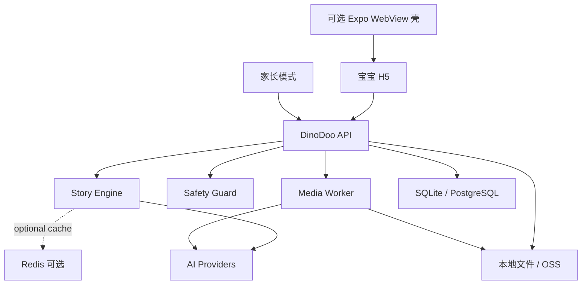

# DinoDoo 简易技术架构方案 V0.1

## 参考对象

本方案参考 `D:\Projects\linkyun` 的整体工程框架，但按 DinoDoo 的 MVP 目标做大幅简化。

LinkYun 当前更像一个完整 AI Agent 平台：

- `linkyun-agent`：Go 后端，集中提供 API、会话、Agent、消息、技能、文件、RAG、worker、运维接口。
- `linkyun-agent-ui/client-web-ui`：Creator 管理后台，Next.js。
- `linkyun-concept`：用户侧 H5，Vite + React。
- `linkyun-mobile-app`：Expo WebView 壳，先承载 H5，再逐步替换原生页面。
- `deployments/docker`：单机 Docker Compose，包含 app、MySQL、Redis、Chroma、Nginx。
- `scripts/start-local.ps1`：本地一键启动不同调试 profile。

DinoDoo 不需要照搬它的全部能力。我们只借它的几个好骨架：

- 多项目工作区，而不是单个混杂项目。
- 后端清晰分层：handler -> service -> repository。
- AI 交互统一收口在 Message/Story Service。
- 耗时任务用 worker，不阻塞主请求。
- 前端、移动壳、后端、部署脚本分开。
- 本地开发脚本一键启动。

## DinoDoo 推荐简化形态

第一版建议做成：

```text
DinoDoo/
  apps/
    h5/                  宝宝游玩 H5，移动端优先
    parent-admin/         家长设置页，可先和 h5 合并
  server/
    cmd/api/              后端入口
    internal/
      api/                HTTP handlers
      story/              故事状态机
      dino/               恐龙角色配置
      safety/             儿童内容安全规则
      ai/                 LLM / STT / TTS / Image provider
      media/              卡片、音频、图片资产
      repository/         数据访问
      worker/             异步生成任务
  packages/
    shared/               前后端共享类型，可后置
  deployments/
    docker/               本地/单机部署
  scripts/
    start-local.ps1       本地启动入口
  docs/
```

如果要更快落地，也可以先合并成：

```text
apps/web        一个 Vite React H5，同时包含宝宝模式和家长模式
server          一个轻量 API 服务
```

## 总体架构



## 和 LinkYun 的映射关系

| LinkYun 模块 | DinoDoo 简化版 | 说明 |
|---|---|---|
| Creator / User / Workspace | Parent / Child Profile | 不做多工作区协作，只保留家长和宝宝档案。 |
| Agent | Dino Character | 不是开放创建 Agent，而是 3 到 5 个预设恐龙角色。 |
| Session | Play Session | 一次 1 到 3 分钟的故事互动。 |
| MessageService | StoryTurnService | 每轮根据状态生成恐龙台词、动作和两个选择。 |
| Group Chat | Dino Theater | 多恐龙同场演出，但后端可先用单 Agent 模拟。 |
| Skills | Built-in Actions | 只保留固定动作：讲故事、生成卡片、TTS、STT。 |
| RAG / KnowledgeBase | 暂不需要 | MVP 不做真实恐龙知识库，避免产品跑偏。 |
| Moment / Social Feed | 暂不需要 | 不做公开社区和陌生人社交。 |
| Edge Runtime | 暂不需要 | MVP 先云端或本地服务跑通。 |
| Ops API | 简化 metrics | 保留 `/health`、`/ready` 和少量 usage 统计即可。 |

## 后端分层

参考 LinkYun 的 Go 分层，DinoDoo 可以这样设计：

```text
server/
  cmd/api/main.go
  internal/
    api/
      story_handler.go
      parent_handler.go
      media_handler.go
      health_handler.go
    service/
      story_turn_service.go
      play_session_service.go
      card_generation_service.go
      parent_settings_service.go
    story/
      state.go
      reducer.go
      templates.go
      choice_policy.go
    dino/
      profiles.go
      voices.go
      style_rules.go
    safety/
      input_guard.go
      output_guard.go
      image_prompt_guard.go
    ai/
      llm_provider.go
      stt_provider.go
      tts_provider.go
      image_provider.go
    repository/
      play_session_repository.go
      parent_settings_repository.go
      artifact_repository.go
    worker/
      card_worker.go
      cleanup_worker.go
```

核心原则：

- `api` 只做参数解析、鉴权和响应。
- `service` 负责编排业务流程。
- `story` 是 DinoDoo 的核心，不依赖 HTTP 和数据库。
- `ai` 只做 provider 抽象，方便以后换模型。
- `safety` 独立成层，所有输入、输出、图片 prompt 都经过它。
- `repository` 只负责存取，不写故事逻辑。

## 核心请求链路

### 1. 开始一局故事

```text
POST /api/v1/play-sessions
  -> 校验家长设置
  -> 创建 PlaySession
  -> 加载主题和恐龙角色
  -> Story Engine 生成开场
  -> 返回台词、语音任务、两个选择
```

### 2. 宝宝说话或点击选择

```text
POST /api/v1/play-sessions/{id}/turns
  -> 输入安全检查
  -> 更新 story state
  -> LLM 生成下一轮台词
  -> 输出安全检查
  -> 保存 turn
  -> 返回 assistant turn + choices
```

### 3. 结束后生成恐龙卡片

```text
POST /api/v1/play-sessions/{id}/finish
  -> 汇总故事状态
  -> 生成结构化 card prompt
  -> 图片 prompt 安全检查
  -> 提交 card generation job
  -> 返回 job_id
```

### 4. 查询作品

```text
GET /api/v1/artifacts
  -> 只返回当前家长/设备下的作品
  -> 支持删除、保存、重新播放故事摘要
```

## 数据模型

MVP 可以先用 SQLite。上线后如果需要账号、多设备同步，再换 PostgreSQL。

核心表：

```text
parent_settings
  id
  daily_minutes_limit
  enabled_themes
  image_generation_enabled
  save_audio_enabled
  memory_enabled
  created_at
  updated_at

child_profiles
  id
  nickname
  age_group
  favorite_dino
  created_at
  updated_at

dino_profiles
  id
  code
  name
  species
  personality
  catchphrase
  voice_style
  system_rules

play_sessions
  id
  child_id
  theme
  scene
  goal
  status
  story_state_json
  started_at
  ended_at

story_turns
  id
  session_id
  speaker
  role
  text
  choices_json
  safety_flags_json
  created_at

artifacts
  id
  session_id
  type
  title
  prompt_json
  file_path
  status
  created_at
```

后置表：

- `usage_events`：统计每日时长、生成次数。
- `media_jobs`：图片和音频生成任务。
- `parent_accounts`：多设备登录时再加。

## AI 模块设计

不要把业务绑死在某个模型 SDK 上。建议统一抽象：

```text
LLMProvider
  generateStoryTurn(input) -> StoryTurnDraft
  generateCardPrompt(input) -> CardPrompt

STTProvider
  transcribe(audio) -> text

TTSProvider
  synthesize(text, voiceStyle) -> audioFile

ImageProvider
  generateCard(prompt) -> imageFile
```

MVP 的重要约束：

- LLM 输出必须是 JSON，不直接自由文本返回给前端。
- 每轮最多一段台词和两个选择。
- 所有生成内容先过 `SafetyGuard` 再保存和展示。
- 图片生成异步化，失败时给“稍后再试”或保留 prompt。

## Story Engine 是核心

DinoDoo 不应该是普通聊天 API。核心应是故事状态机：

```text
StoryState
  theme
  scene
  goal
  activeDino
  turnIndex
  mood
  collectedItems
  lastBabyIntent
  nextChoices
  cardSeed
```

每轮流程：

```text
Baby Input
  -> classify intent
  -> reduce StoryState
  -> select active dino
  -> generate short line
  -> generate two choices
  -> update card seed
```

这就是之前说的“状态机控节奏，LLM 添灵气”。它比纯 Chat 稳，尤其适合 3 岁宝宝。

## 前端架构

建议先做一个移动端优先的 Vite React H5，参考 LinkYun 用户侧 H5，而不是先做复杂后台。

```text
apps/h5/
  src/
    app/
      routes.tsx
    features/
      play/
        PlayScreen.tsx
        usePlaySession.ts
        VoiceButton.tsx
        ChoiceButtons.tsx
      parent/
        ParentSettingsScreen.tsx
        ArtifactGallery.tsx
      artifacts/
        DinoCardView.tsx
    lib/
      api.ts
      audio.ts
      storage.ts
    styles/
```

界面只保留三块：

- `/play`：宝宝游玩页。
- `/artifacts`：今日作品页。
- `/parent`：家长设置页。

移动 App 暂时可以像 LinkYun 一样用 Expo WebView 壳：

```text
apps/mobile-shell/
  Expo + WebView
  SecureStore 保存家长 token
  postMessage 支持保存图片、分享、打开外链
```

## 本地开发和部署

参考 LinkYun 的 `scripts/start-local.ps1`，DinoDoo 也应该提供 profile：

```powershell
scripts/start-local.ps1 -Profile h5
scripts/start-local.ps1 -Profile api
scripts/start-local.ps1 -Profile all
```

MVP 本地依赖：

```text
api:        http://localhost:8080
h5:         http://localhost:5173
sqlite:     local file
files:      ./data
```

上线初期部署：

```text
Nginx
  -> H5 static files
  -> API service
API service
  -> SQLite/PostgreSQL
  -> file storage
  -> AI providers
```

后续有规模再加：

- Redis：缓存 session、TTS 任务状态、限流。
- PostgreSQL：多账号、多设备同步。
- OSS/S3：作品图片和音频文件。
- Queue：图片生成、TTS、清理任务。

## MVP API 清单

```text
GET  /health
GET  /ready

GET  /api/v1/dinos
GET  /api/v1/themes

GET  /api/v1/parent/settings
PUT  /api/v1/parent/settings

POST /api/v1/play-sessions
GET  /api/v1/play-sessions/{id}
POST /api/v1/play-sessions/{id}/turns
POST /api/v1/play-sessions/{id}/finish

POST /api/v1/audio/transcriptions
POST /api/v1/audio/speech

GET  /api/v1/artifacts
GET  /api/v1/artifacts/{id}
DELETE /api/v1/artifacts/{id}
```

图片生成可以先不开放独立 API，而由 `/finish` 触发。

## 先不要做的东西

从 LinkYun 看，这些能力很强，但 DinoDoo 第一版不该做：

- 多工作区。
- Creator 协作权限。
- Agent 市场。
- 公开发现页。
- 关注、点赞、评论、动态流。
- RAG 知识库。
- Edge Runtime。
- 多 Agent 真并发。
- 复杂 skill marketplace。
- 大型运维 MCP。

这些都会让 MVP 变成平台项目，而 DinoDoo 现在最需要的是把“宝宝和恐龙玩起来”跑通。

## 推荐实施顺序

### P0：纯前端故事状态机

- `apps/h5` 单页。
- 内置 3 个恐龙 profile。
- 内置 1 个主题。
- 不接 LLM，先用模板推进故事。
- 验证宝宝交互节奏。

### P1：接入后端 Story API

- 建 `server`。
- `POST /play-sessions`。
- `POST /turns`。
- SQLite 保存 session 和 turns。
- 保留模板模式作为 fallback。

### P2：接入 LLM

- `ai/LLMProvider`。
- 让 LLM 只输出结构化 `StoryTurnDraft`。
- 加输入输出 safety guard。

### P3：语音和卡片

- STT：宝宝语音转文字。
- TTS：恐龙台词转音频。
- Image：结束后生成恐龙卡片。
- 异步 job 和作品列表。

### P4：移动壳

- Expo WebView。
- 保存图片到相册。
- 家长 token 安全存储。

## 我建议采用的技术栈

最稳妥、贴近 LinkYun 且不重的选择：

- 前端：Vite + React + TypeScript + Zustand + Tailwind。
- 后端：Go + net/http/gorilla mux 或 Fastify/Node 二选一。
- 数据：SQLite 起步，PostgreSQL 后置。
- 缓存/队列：Redis 后置。
- 文件：本地 `data/` 起步，OSS 后置。
- 移动：Expo WebView 后置。

如果我们想最大限度复用 LinkYun 的工程经验，我更推荐后端用 Go；如果想最快做交互原型，则可以先用 Node/Fastify。DinoDoo 的长期形态更适合 Go 后端，因为语音、图片任务、worker、限流和安全策略会越来越多。

## 一句话结论

DinoDoo 可以参考 LinkYun 的“多端前端 + 单后端 + 分层服务 + worker + Docker + 启动脚本”框架，但第一版要收缩成：

```text
H5 宝宝游玩页
  + 家长设置页
  + Story Engine API
  + SQLite
  + 本地文件
  + 可插拔 AI Provider
```

先把 3 岁宝宝的短故事互动闭环做顺，再逐步接语音、图片、移动壳和云端存储。
